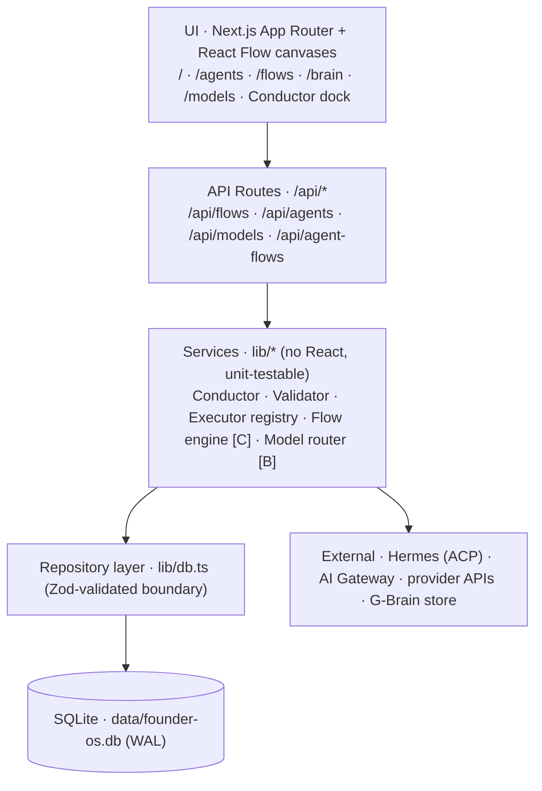
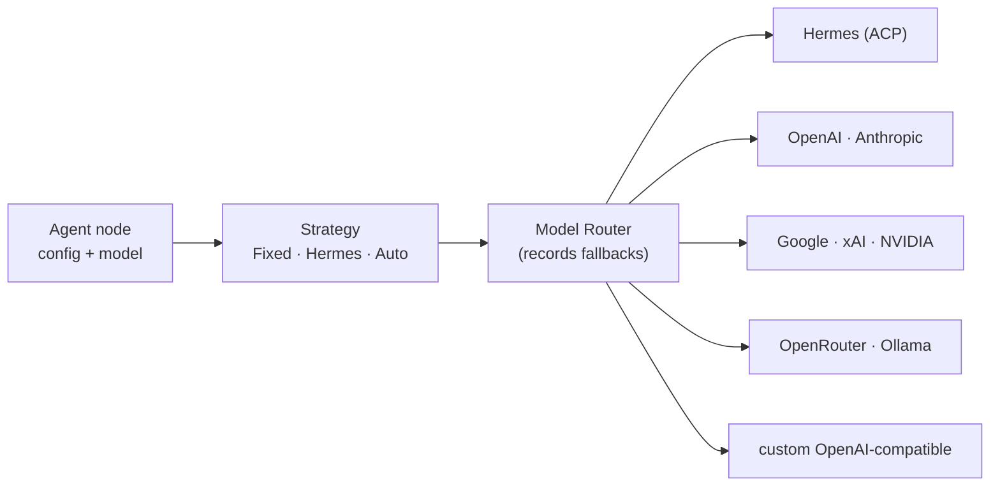
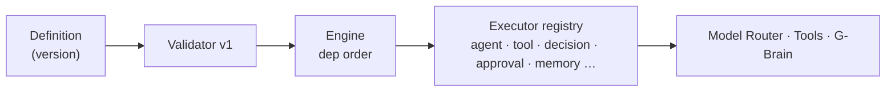
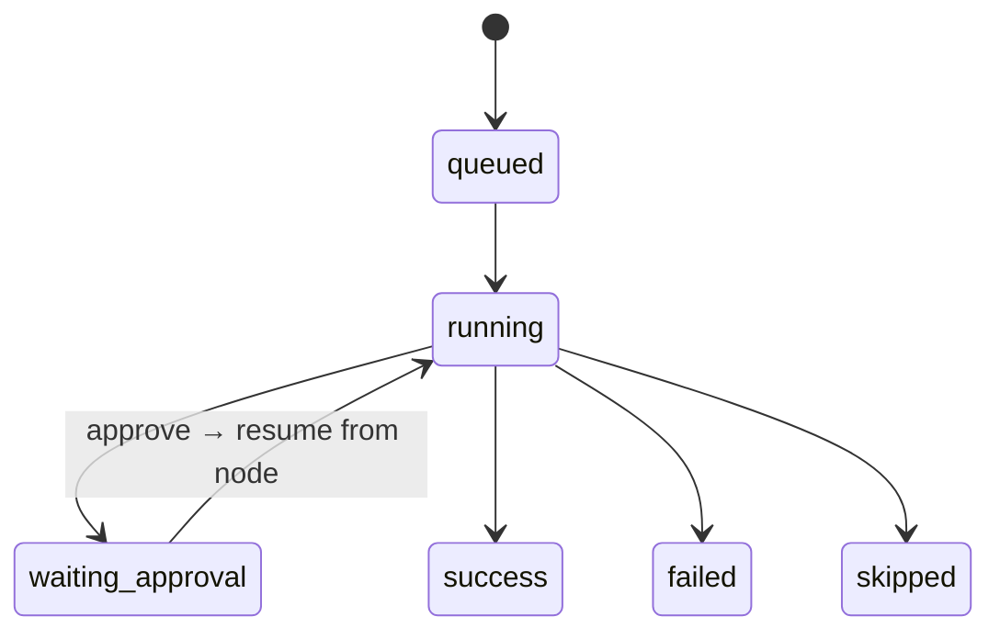

# IGRIS Agent — System Architecture

> A personal AI operator OS (Next.js command center) and the visual workflow engine
> growing inside it: **G-Brain Flow**. This is the whole system as it stands, plus the
> architecture we are building toward, phase by phase.
>
> Status marker in this doc: **✅ live** · **▶ next** · **○ planned**.
> Last updated: **Phase C complete**. Companion docs: `AI-HANDOFF.md` (entry),
> `PHASE-STATUS.md` (status + invariants), `DATA-MODEL.md`, `CODING-METHODOLOGY.md`,
> `DECISIONS.md`. The root `AGENTS.md` carries the code-ownership map and rules.

---

## 1. Overview & stack

IGRIS is a web command center where a client connects tools and models, shapes their own
agents, and drives everything through the **Conductor**. It looks alive on day one thanks to
rich seeded data, but every surface reads through a repository layer so seeded tables can be
swapped for live sources without touching pages.

| Layer | Choice |
|---|---|
| Framework | Next.js 14 (App Router, React Server Components) |
| Language | TypeScript |
| Validation | Zod (every DB/API boundary) |
| Persistence | better-sqlite3 — `data/founder-os.db` (WAL, auto-seeded) |
| Canvas | React Flow v12 (`@xyflow/react`) |
| Brains / LLM | Hermes (persistent ACP), Vercel AI Gateway, OpenAI-compatible providers, stub |
| Tests | Vitest |
| Port | **4100** |

---

## 2. Core design rules

1. **Larp-first, real-ready.** Pages/routes never query SQLite directly — always the repo
   layer (`lib/db.ts`). Swapping a seeded table for a live source is a repo-level change.
2. **Three separated concerns — never merged:**
   - **Agents & Models** (`/agents`, `/models`) — who does the work + what they think on.
   - **G-Brain Flow** (`/flows`) — the executable workflow orchestrator.
   - **G-Brain knowledge** (`/brain`) — stored knowledge/memory + its graph visualization.
   The workflow engine never becomes the knowledge graph; not every LLM output becomes memory.
3. **Services, not components, orchestrate.** Execution/routing logic lives in `lib/*`
   (no React, unit-testable). The visual graph is a workflow **definition**; execution happens
   in backend services.
4. **Honest state.** Connectors report real status (never fake "connected"); unsupported nodes
   say so; failures surface with output, never silently.
5. **Definition vs. run history are separate.** Editable drafts vs. immutable versions vs.
   run records live in distinct tables.

---

## 3. Directory / module map

```
app/
  page.tsx                 operator console            api/agents/*       agent CRUD, run, chat
  agents/  models/         roster + model providers    api/models/route   provider connect/test
  flows/   brain/          orchestrator + knowledge    api/flows/*         workflow CRUD + versions
  api/agent-flows/*        legacy canvas (kept working)

lib/
  data.ts  db.ts  seed.ts  schemas.ts                  data + repos + Zod
  agents/  runtime.ts real.ts custom.ts chat.ts        agent registry + per-agent chat
           conductor.ts registry.ts                    Conductor router (operator mode)
  connectors/ llm.ts hermes-acp.ts gateway hermes-cli  LLM brains + provider adapters
              openai-compatible.ts gbrain.ts            direct providers + knowledge read
  models/  catalog.ts resolve.ts                        provider catalog + per-agent resolve
  flows/   schema.ts node-types.ts registry.ts         ORCHESTRATOR FOUNDATION (Phase A)
           validator.ts
  brain-dump.ts                                         knowledge write path

components/
  ConductorPanel.tsx  AgentBuilder.tsx  ModelsBoard.tsx
  AgentFlowCanvas.tsx                                   legacy canvas (kept working)
  flows/ FlowWorkspace.tsx  FlowCanvas.tsx              new typed orchestrator UI
```

---

## 4. Layered architecture

Requests descend the stack; services also reach outward to brains, providers, and the
knowledge store.



The frontend graph is a **definition only**. `[B]`/`[C]` mark layers that arrive in later phases.

---

## 5. Data layer

- `lib/data.ts` — `getDb()` app singleton; seeds on first touch.
- `lib/db.ts` — `openDb()` builds the SQLite schema (`CREATE TABLE IF NOT EXISTS`), runs
  guarded `ALTER TABLE` migrations, and exposes repositories. **Migrations are additive and
  idempotent** (guarded by `pragma table_info` or a deterministic id/meta flag).
- `lib/schemas.ts` — Zod schemas validate rows on the way **out** of the DB.
- Pattern for any new data: **new repo method + Zod schema + seed entry + test.**

See §12 for the full table inventory.

---

## 6. Agents

- **Built-in roster** (`lib/agents/real.ts`) — code-defined agents, each 1:1 with a
  `RuntimeAgent` that has a real `run()`.
- **Custom agents** (`custom_agents` table + `lib/agents/custom.ts`) — pure data: a name,
  instructions (system prompt), tools, and a `model`. A generic runtime turns each row into a
  live `RuntimeAgent`, so a client creates/customizes agents with no code change.
- **Per-agent chat** (`lib/agents/chat.ts`) — builds the system prompt, calls the LLM layer
  with the agent's tools **and its `model`**, persists turns.
- **Conductor** (`lib/agents/conductor.ts`) — the operator brain. Three routes:
  1. `@agent …` → delegate to a specialist.
  2. An operator request (create/edit/delete/run an agent or the flow) → propose a structured
     **action** the UI confirms before executing (**confirm-each**, human-in-the-loop).
  3. Anything else → the Conductor answers directly, grounded in the current screen.

---

## 7. Model architecture

Agents are never bound to one provider. An agent carries a **strategy**; a router resolves it
to a concrete adapter at call time.



**Today (live):** `lib/connectors/llm.ts` `chat()` inspects the request's `model`:
- `providerId:modelId` (e.g. `openai:gpt-4o`) → routes to that **connected** provider via the
  OpenAI-compatible client (`lib/connectors/openai-compatible.ts`).
- otherwise → the active **brain** (default Hermes).

**Models board** (`/models`, `lib/models/*`): connect a provider with its API key (stored in
`.env.local`, gitignored), optional base URL, **test / live model fetch**. Providers today:
OpenAI, Anthropic, xAI, DeepSeek, Groq, Mistral, OpenRouter, Together (all OpenAI-compatible).

**Security:** keys never leave the backend. The frontend only learns whether a credential
exists; errors are redacted; the app-wide `model_provider_connections` table stores enabled
state, base URL, and health timestamps — **never** the key value.

**Model Router (Phase B, live):** `lib/models/router.ts` resolves an agent's strategy
(Fixed/Hermes/**Auto** = safe stub → `auto_not_implemented`) to a concrete adapter. Adapters:
Hermes (ACP) for `hermes`, and the OpenAI-compatible client for `fixed` providers
(OpenAI/Anthropic/Google/xAI/NVIDIA/DeepSeek/Groq/Mistral/OpenRouter/Together/Ollama/custom).
Per-agent model config lives in `AgentBuilder`; model badges show on flow agent nodes. No
silent fallback (`fallbackUsed` always false today).

### LLM brains (adapters)

| Adapter | Notes |
|---|---|
| `hermes-acp` | Persistent Hermes over an **ACP JSON-RPC/stdio** process — boot once, ~8s warm per call. Full Hermes (tools/MCP/memory). |
| `gateway` | Vercel AI Gateway (`ai` SDK) — `provider/model` strings, tool-calling. |
| `hermes-cli` | One-shot `hermes chat` — ~31s cold start per call (fallback). |
| `openai-compatible` | Direct `/chat/completions` to any connected provider. |
| `stub` | Deterministic, offline — tests. |

---

## 8. G-Brain Flow — the orchestrator

A workflow is a **directed graph of typed nodes + edges**, executed in dependency order.

### 8.1 Node system

Nodes are a discriminated union on `type`; each type owns a config schema + a registered
executor (`lib/flows/schema.ts`, `node-types.ts`, `registry.ts`). Adding a type is one
`register(...)` call — never a scattered switch. Colour is always paired with an icon + text.

| Node | Category | Runnable in |
|---|---|---|
| Input | io | Phase C |
| AI Agent | agent | Phase C |
| Tool | tool | later |
| Decision | logic | Phase D |
| Human Approval | human | Phase E |
| Memory (G-Brain) | memory | Phase F |
| Transform | transform | Phase D |
| Parallel / Join | control | Phase D |
| Output | io | Phase C |

Until its phase lands, a placed node renders honestly as **"not runnable yet · Phase X"** — the
canvas never pretends an unsupported node works. Edges carry a `mapping` (whole output today;
`{{Node.field}}` + conditions in Phase D) — never a permanently dumb text pipe.

### 8.2 Execution engine & run lifecycle  ✅ (Phase C)

Execution is a backend concern, decoupled from React Flow.



Run lifecycle (state persisted per node so the UI polls, not one blocking request):



The engine threads a **typed** workflow state (not concatenated text), persists each node-run
incrementally, and **pauses at approval nodes and resumes from that node** rather than
restarting.

### 8.3 Persistence — draft vs. immutable version  ✅ (Phase A)

- `flow_workflows` — workflow identity + metadata + **editable draft graph** + `current_version`
  pointer.
- `flow_versions` — **immutable** graph snapshots, `UNIQUE(workflow_id, version)`.
- Normal **Save** updates the draft (no version churn). **Publish** freezes the draft into a new
  immutable version — so a historical run always references a stable definition.

### 8.4 API  ✅ (Phase A)

```
GET  /api/flows                    list workflows
POST /api/flows                    create { name }
GET  /api/flows/:id                workflow + draft graph + versions
PATCH /api/flows/:id               save draft graph and/or rename (validation non-blocking)
DELETE /api/flows/:id              remove workflow + its versions
GET  /api/flows/:id/versions       list versions
POST /api/flows/:id/versions       publish draft as immutable version (validated; invalid → 400)
```

### 8.5 Validator v1  ✅

`lib/flows/validator.ts` (pure) detects: duplicate node ids · dangling edges · self-edges ·
missing agent references · malformed configs · invalid edge refs · **cycles (DAG-only)** ·
empty workflow. Non-blocking on draft save; blocking on publish.

### 8.6 Migration of the legacy canvas  ✅

On DB open, the legacy `agent_flows` "main" canvas imports **once** into workflow `wf-main`
(draft + immutable v1), preserving name, node positions, agent references, and edges. Idempotent
(keyed on `wf-main`); the old table is **never deleted**; `/api/agent-flows` + `AgentFlowCanvas`
stay operational during the transition.

---

## 9. G-Brain knowledge (kept separate)

- Markdown knowledge in a local brain-store with an embeddings backend + CLI provider
  (`lib/connectors/gbrain.ts`), plus the radial / neural graph on `/brain`. A map of stored
  knowledge — **not** agents, **not** execution.
- **Memory rule:** runs do **not** auto-dump every LLM output into permanent knowledge. Memory
  is an explicit per-node choice (read/write/mode), conservative by default. Transient run data
  stays in run history unless promoted (Phase F).

---

## 10. Security & human-in-the-loop

- **Secrets stay backend.** API keys in `.env.local` (gitignored); frontend learns only whether
  a credential exists; errors redacted.
- **A connection is not consent.** A visual edge never authorizes a destructive act. Sending
  mail, submitting an application, deleting data, spending money → must pass a first-class
  **Human Approval** node.
- **Remove ≠ Delete.** Taking a node off the canvas keeps the agent; deleting the agent is a
  separate, two-step, everywhere action.

---

## 11. Conventions & testing

- **TDD**: failing test first. Tests in `tests/`, one per module; `openDb(':memory:')` /
  `FOUNDER_OS_DB=:memory:` for isolation. Stub LLM/brain providers keep tests offline.
- **Zod-validate** anything crossing the DB or API boundary.
- **Theme**: Monolith Signal (mono) default; JetBrains Mono; square corners; hairline borders;
  status-only colour. Tokens in `tailwind.config.ts` + `app/globals.css`.
- **Gates before "done"**: `tsc --noEmit` (no lint script in repo) + relevant tests + full-suite
  regression.
- Heavy visualizations load via `next/dynamic` (`ssr: false`) behind sized skeletons.

---

## 12. Data model (table inventory)

| Table | Holds | Status |
|---|---|---|
| `custom_agents` | Client-authored agents (name, instructions, tools, model) | ✅ |
| `agents` · `departments` · `tools` | Built-in roster + org scaffolding | ✅ |
| `agent_runs` · `agent_messages` | Per-agent run + chat history (model, tokens, cost) | ✅ |
| `agent_flows` | Legacy single canvas — kept working during transition | ✅ compat |
| `flow_workflows` | Workflow identity + metadata + **draft graph** + current-version pointer | ✅ Phase A |
| `flow_versions` | **Immutable** graph snapshots — `UNIQUE(workflow_id, version)` | ✅ Phase A |
| `model_provider_connections` | App-wide provider status/enabled/base-URL/last-check — **never the secret** | ✅ Phase B |
| `flow_runs` · `flow_node_runs` | Run + per-node execution state, tokens, duration, errors | ✅ Phase C |
| `flow_approvals` | Human-approval decisions bound to a paused run/node | ○ Phase E |

(Plus the many operational/business tables: metrics, funnel, social, roadmap, skills, people, …)

---

## 13. Roadmap to done

Each phase is independently shippable and test-gated, with an approval checkpoint before the
next. Nothing ships as one risky rewrite.

| Phase | Delivers | Status |
|---|---|---|
| **A · Foundation** | flow_* schema + migration, typed node/edge schemas, executor registry, validator v1, `/flows` route, create/version/save, main-flow import | ✅ done |
| **B · Model routing** | ModelRouter (Fixed/Hermes/Auto), provider connections, per-agent model config + node badges, wider adapters | ✅ done |
| **C · Execution engine** | dependency execution, typed structured state, persisted runs/node-runs, Run Inspector (poll) | ✅ done |
| **D · Logic nodes** | decision/router, transform, parallel/join, conditional edges + `{{Node.field}}` mapping | ▶ next |
| **E · Human approval** | approval node, durable pause/resume, approval UI, destructive-action gates | ○ planned |
| **F · Memory** | explicit G-Brain read/write nodes, controlled knowledge promotion | ○ planned |
| **G · Reliability** | retries, error routes, recorded model fallback, versioning polish | ○ planned |

**End state:** *G-Brain Flow is a visual AI workflow orchestration engine* where agents, models,
tools, logic, human approvals, and memory connect into executable workflows — a purpose-built AI
orchestration environment, not a node diagram. The job-application pipeline is **one workflow it
can run**, never a behavior baked into the engine.

---

## 14. Key files

| Concern | Files |
|---|---|
| Data / repos | `lib/data.ts`, `lib/db.ts`, `lib/schemas.ts`, `lib/seed.ts` |
| Agents | `lib/agents/runtime.ts`, `real.ts`, `custom.ts`, `chat.ts`, `conductor.ts` |
| Models | `lib/models/catalog.ts`, `resolve.ts`, `lib/connectors/openai-compatible.ts`, `llm.ts` |
| Brains | `lib/connectors/hermes-acp.ts`, `hermes-cli.ts`, `gateway` (in `llm.ts`) |
| Flow foundation | `lib/flows/schema.ts`, `node-types.ts`, `registry.ts`, `validator.ts` |
| Flow API | `app/api/flows/route.ts`, `[id]/route.ts`, `[id]/versions/route.ts` |
| Flow UI | `app/flows/page.tsx`, `components/flows/FlowWorkspace.tsx`, `FlowCanvas.tsx` |
| Knowledge | `lib/brain-dump.ts`, `lib/connectors/gbrain.ts` |
| Legacy (compat) | `app/api/agent-flows/*`, `lib/agents/flow-run.ts`, `components/AgentFlowCanvas.tsx` |
