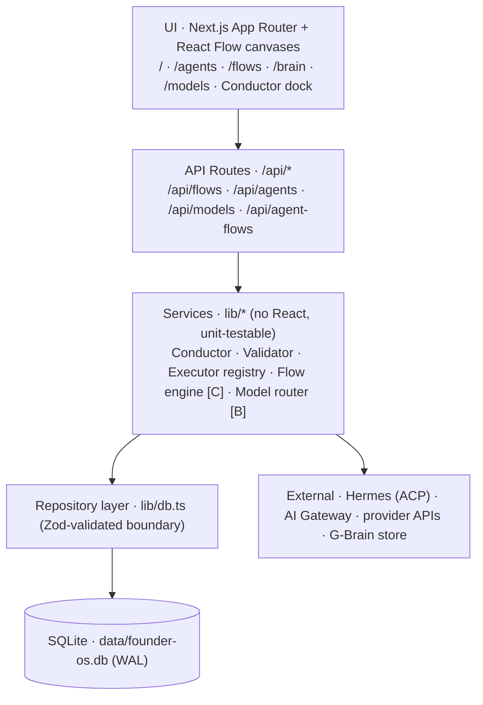
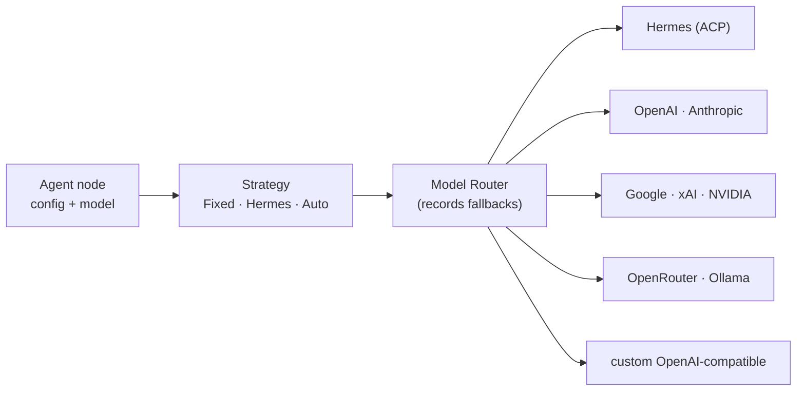
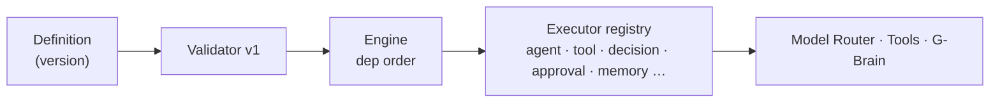
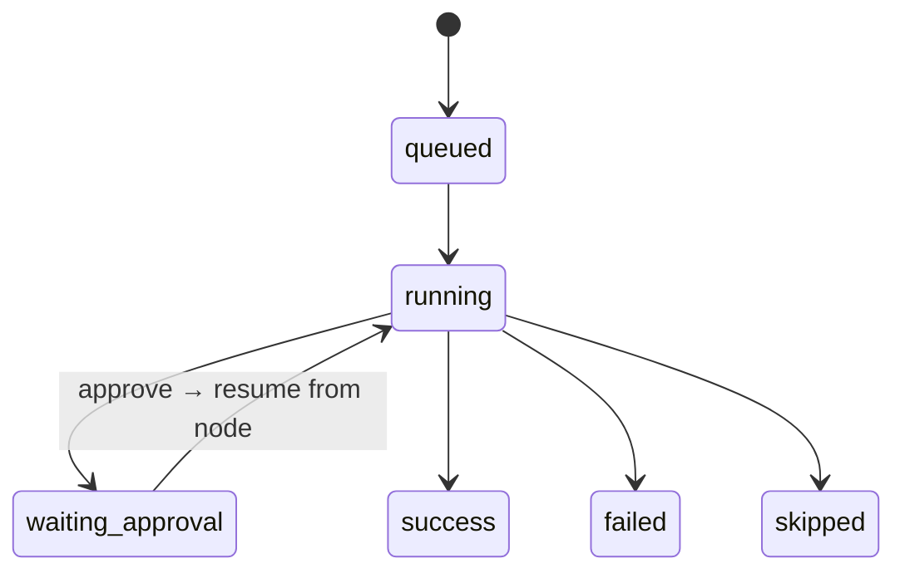

# IGRIS Agent — System Architecture

> A personal AI operator OS (Next.js command center) and the visual workflow engine
> growing inside it: **G-Brain Flow**. This is the whole system as it stands, plus the
> architecture we are building toward, phase by phase.
>
> Status marker in this doc: **✅ live** · **▶ next** · **○ planned**.
> Last updated: **Phase E complete** (Human Approval node + durable pause/resume; Phase D logic nodes, references, mapping, branching, Parallel/Join). Companion docs: `AI-HANDOFF.md` (entry),
> `PHASE-STATUS.md` (status + invariants), `DATA-MODEL.md`, `CODING-METHODOLOGY.md`,
> `DECISIONS.md`. The root `AGENTS.md` carries the code-ownership map and rules.

---

## 1. Overview & stack

IGRIS is a web command center where a client connects tools and models, shapes their own
agents, and drives everything through the **Conductor**. It looks alive on day one thanks to
rich seeded data, but every surface reads through a repository layer so seeded tables can be
swapped for live sources without touching pages.

| Layer | Choice |
|---|---|
| Framework | Next.js 14 (App Router, React Server Components) |
| Language | TypeScript |
| Validation | Zod (every DB/API boundary) |
| Persistence | better-sqlite3 — `data/founder-os.db` (WAL, auto-seeded) |
| Canvas | React Flow v12 (`@xyflow/react`) |
| Brains / LLM | Hermes (persistent ACP), Vercel AI Gateway, OpenAI-compatible providers, stub |
| Tests | Vitest |
| Port | **4100** |

---

## 2. Core design rules

1. **Larp-first, real-ready.** Pages/routes never query SQLite directly — always the repo
   layer (`lib/db.ts`). Swapping a seeded table for a live source is a repo-level change.
2. **Three separated concerns — never merged:**
   - **Agents & Models** (`/agents`, `/models`) — who does the work + what they think on.
   - **G-Brain Flow** (`/flows`) — the executable workflow orchestrator.
   - **G-Brain knowledge** (`/brain`) — stored knowledge/memory + its graph visualization.
   The workflow engine never becomes the knowledge graph; not every LLM output becomes memory.
3. **Services, not components, orchestrate.** Execution/routing logic lives in `lib/*`
   (no React, unit-testable). The visual graph is a workflow **definition**; execution happens
   in backend services.
4. **Honest state.** Connectors report real status (never fake "connected"); unsupported nodes
   say so; failures surface with output, never silently.
5. **Definition vs. run history are separate.** Editable drafts vs. immutable versions vs.
   run records live in distinct tables.

---

## 3. Directory / module map

```
app/
  page.tsx                 operator console            api/agents/*       agent CRUD, run, chat
  agents/  models/         roster + model providers    api/models/route   provider connect/test
  flows/   brain/          orchestrator + knowledge    api/flows/*         workflow CRUD + versions
  api/agent-flows/*        legacy canvas (kept working)

lib/
  data.ts  db.ts  seed.ts  schemas.ts                  data + repos + Zod
  agents/  runtime.ts real.ts custom.ts chat.ts        agent registry + per-agent chat
           conductor.ts registry.ts                    Conductor router (operator mode)
  connectors/ llm.ts hermes-acp.ts gateway hermes-cli  LLM brains + provider adapters
              openai-compatible.ts gbrain.ts            direct providers + knowledge read
  models/  catalog.ts resolve.ts                        provider catalog + per-agent resolve
  flows/   schema.ts node-types.ts registry.ts         ORCHESTRATOR FOUNDATION (Phase A)
           validator.ts
  brain-dump.ts                                         knowledge write path

components/
  ConductorPanel.tsx  AgentBuilder.tsx  ModelsBoard.tsx
  AgentFlowCanvas.tsx                                   legacy canvas (kept working)
  flows/ FlowWorkspace.tsx  FlowCanvas.tsx              new typed orchestrator UI
```

---

## 4. Layered architecture

Requests descend the stack; services also reach outward to brains, providers, and the
knowledge store.



The frontend graph is a **definition only**. `[B]`/`[C]` mark layers that arrive in later phases.

---

## 5. Data layer

- `lib/data.ts` — `getDb()` app singleton; seeds on first touch.
- `lib/db.ts` — `openDb()` builds the SQLite schema (`CREATE TABLE IF NOT EXISTS`), runs
  guarded `ALTER TABLE` migrations, and exposes repositories. **Migrations are additive and
  idempotent** (guarded by `pragma table_info` or a deterministic id/meta flag).
- `lib/schemas.ts` — Zod schemas validate rows on the way **out** of the DB.
- Pattern for any new data: **new repo method + Zod schema + seed entry + test.**

See §12 for the full table inventory.

---

## 6. Agents

- **Built-in roster** (`lib/agents/real.ts`) — code-defined agents, each 1:1 with a
  `RuntimeAgent` that has a real `run()`.
- **Custom agents** (`custom_agents` table + `lib/agents/custom.ts`) — pure data: a name,
  instructions (system prompt), tools, and a `model`. A generic runtime turns each row into a
  live `RuntimeAgent`, so a client creates/customizes agents with no code change.
- **Per-agent chat** (`lib/agents/chat.ts`) — builds the system prompt, calls the LLM layer
  with the agent's tools **and its `model`**, persists turns.
- **Conductor** (`lib/agents/conductor.ts`) — the operator brain. Three routes:
  1. `@agent …` → delegate to a specialist.
  2. An operator request (create/edit/delete/run an agent or the flow) → propose a structured
     **action** the UI confirms before executing (**confirm-each**, human-in-the-loop).
  3. Anything else → the Conductor answers directly, grounded in the current screen.

---

## 6b. Company Registry — Capability layer (Architecture V2 · F0.1)  ✅

A first-class **Capability** layer over the SAME registry (built-in roster +
custom agents), so future Manager logic (F1) can ask *"which agents can perform
capability X?"* by capability instead of loading/reasoning over the whole roster.
This checkpoint is **registry / data / resolution only** — no task assignment, no
delegation, no agent creation, **no execution**.

- **The four distinct concepts (kept explicit):**
  - **Capability** — WHAT WORK an agent CAN perform (`domain.action`, e.g.
    `email.summarize`). *Can perform.*
  - **Skill** — reusable instructions/behavior that may SUPPORT a capability.
  - **Tool** — an external/local mechanism (Gmail) that may SUPPORT a capability.
  - **Model** — the intelligence the agent thinks on.
  - **Permission** — whether the agent is AUTHORIZED to do it. **A capability is
    NOT a permission**: `email.send` as a capability means the agent *can* draft/send,
    never that it *may* without the Phase-E Human **Approval** that authorizes it.
- **Model** (`lib/agents/capabilities.ts`, pure + unit-tested): `Capability {id,
  name, description?, domain?}`; `AgentCapability {agentId, capabilityId,
  proficiency?, source}`. Capability ids are stable machine ids — lowercase,
  trimmed, `domain.action` (validated; malformed rejected). `proficiency` is
  optional 0–100 CONFIG metadata (not measured performance; unrated = neutral 50
  for ranking, `null` in output).
- **Persistence** (`lib/db.ts`, additive + idempotent): `capabilities` and
  `agent_capabilities` tables. `agent_id` is the **canonical RuntimeAgent id**
  (built-in OR `custom-*`) — deliberately **not an FK**, since built-ins are code
  (not rows) and custom agents live in a different table; this keeps one scheme
  that works for both. No existing agent/skill/tool field was changed.
- **Registry service** (`lib/agents/registry.ts`): `getAgentById`,
  `getCapabilitiesForAgent`, `getAgentsForCapability`, and the reusable
  **`resolveAgentsForCapabilities(db, required, {mode})`** the F1 Manager will call.
- **Resolver** — deterministic, **exact-id matching only (no LLM/embedding
  inference)**. `mode: 'all'` (default) requires every capability; `'any'` for
  discovery. Ranking: coverage → explicit-over-derived → proficiency → stable
  name/id tie-break. It answers **WHO COULD DO THIS**, never GO DO THIS — output
  is SAFE metadata only (agentId, name, matched/missing, proficiency, score) with
  no prompts, tools, or secrets.
- **APIs** (Zod, read + registry-mutation only, no execution): `GET/POST
  /api/capabilities`; `GET/POST/DELETE /api/agents/:id/capabilities`; read-only
  `GET /api/agents/resolve?capabilities=…&mode=…`. React never touches SQLite.
- **Not built in F0.1** (deferred): built-in-agent capability seeding (left
  unassigned rather than guessed), `reportsTo`/lifecycle columns (`parentId`
  already carries reporting today), Missions/Tasks (F0.2), Manager (F1), Factory
  (F2). See `docs/CHANGE-LOG.md` UX/F0.1 record.

### 6c. Mission + Company Task canonical model (Architecture V2 · F0.2) ✅

The **company-work layer**: Mission (company-level objective) + Company Task (work
unit). DISTINCT from the existing lightweight `agent_tasks` kanban (untouched).

- **Definitions:** `MISSION` = company-level objective. `COMPANY TASK` = unit of
  work required to complete a Mission. `AGENT` = employee (F0.1 registry).
  `WORKFLOW` = SOP. `RUN` = execution. F0.2 STORES and ORGANIZES work only — it
  does NOT plan, decompose, assign automatically, delegate, or execute. That is F1.
- **Pure model** (`lib/company/model.ts`): types, Zod input/update schemas with
  capability-id normalization, status enums with guarded transitions
  (`MISSION_TRANSITIONS`, `TASK_TRANSITIONS` — explicit manual updates only, never
  auto-driven), terminal-state detection, graph helpers (DFS reachability + cycle
  guard reused for parent tree AND dependency DAG), mission summary (task rollup by
  status — never auto-completes), prerequisite check (read-only — never auto-starts).
- **Service** (`lib/company/service.ts`): canonical create/read/update boundary
  composing the persistence repos, the pure model, and the F0.1 capability resolver.
  `CompanyError` carries an HTTP status for the API routes. Functions: `createMission`,
  `getMission`, `listMissions`, `updateMission`, `missionSummary`;
  `createCompanyTask`, `getCompanyTask`, `listTasksForMission`, `updateCompanyTask`,
  `setTaskCapabilities`; `getEligibleAgentsForTask` (F0.1 `resolveAgentsForCapabilities`
  `mode: all`); `assignTask` (capability-compatibility-checked manual assignment —
  409 if the agent lacks required capabilities); `addTaskDependency`,
  `removeTaskDependency`, `getTaskDependencies` (prerequisites + `satisfied` flag).
- **Parent/subtask:** same-mission only; reparenting cycle-rejected via DFS.
- **Dependencies:** same-mission only; self-dep rejected; cycle-rejected; idempotent
  (PK); `prerequisitesSatisfied` is read-only — F0.2 never auto-transitions a task.
- **Workflow/Run seams:** `workflowId` is a validated SOP reference (never runs);
  `runId` is F1's future execution reference (never created here).
  `waiting_approval` never creates a Phase-E `flow_approvals` row.
- **DB** (additive/idempotent): `company_missions`, `company_tasks`,
  `company_task_dependencies` + 6 indexes. Cross-subsystem references validated in
  the service layer, not by FK, matching the repo canonical-id strategy.
- **APIs** (Zod, narrow, no execution): `GET/POST /api/missions`; `GET/PATCH
  /api/missions/:id`; `GET/POST /api/missions/:id/tasks`; `GET/PATCH
  /api/company-tasks/:id`; `POST /api/company-tasks/:id/assign`; `GET/POST/DELETE
  /api/company-tasks/:id/dependencies`; read-only `GET
  /api/company-tasks/:id/eligible-agents`. React never touches SQLite.
- **UI:** `/missions` page + `MissionsBoard.tsx` (compact admin surface: create
  missions, break into tasks, set required capabilities, view eligible agents,
  manually assign, add dependencies, change statuses).
- **Not built in F0.2** (deferred): F1 Manager planning/decomposition, automatic
  assignment/delegation, Agent Factory (F2), G-Brain F3, pagination, soft-delete.
  See `docs/CHANGE-LOG.md` V2-F0.2 record.

### 6d. Executive Manager / Delegation Engine (Architecture V2 · F1) ✅

The company becomes operable: an **Executive Manager** plans a Mission, decomposes
it into Company Tasks, matches capabilities (F0.1), and DELEGATES to an existing
agent OR an existing published workflow — recording structured Artifacts, an
append-only event ledger, and a report. It **evolves the existing systems**; it is
NOT a parallel engine.

- **Three roles stay separate:** `Commander` = the OWNER's operating surface (U2/U3);
  `Executive Manager` = the AI manager agent (the evolved **Conductor**, tagged
  `role: 'executive_manager'` in the runtime registry — no duplicate id; still the
  chat/ASK operator brain); `Workflow Engine` = the deterministic SOP executor
  (Phase A–E, authoritative for runs + Human Approval).
- **Manager service** (`lib/company/manager/*`): `model.ts` (pure — the CLOSED
  action allow-list, plan/artifact/event schemas + SAFE projections, deterministic
  dispatch/selection/completion policy), `planning.ts`, `delegation.ts`,
  `service.ts`, `artifacts.ts`, `events.ts`. UI/API are thin.
- **Planning ≠ execution.** `planMission` asks the LLM for a plan but the SERVER
  owns safety: the plan is Zod-validated; **task ids are server-generated** (never
  trusted from the LLM); capability ids pass F0.1 validation; dependencies pass F0.2
  validation; a bad plan fails safely; apply is **idempotent by title** (re-plan
  never duplicates). Planning starts no execution.
- **Capability-based delegation (deterministic, exact-id).** For each task the
  policy is: valid **published** workflow → workflow; else an assigned/selected
  eligible agent → agent; else **CAPABILITY_GAP** (task stays queued, structured gap
  reported — **F1 NEVER creates an agent; that is F2**). Agent selection uses the
  F0.1 rank as PRIMARY and real **U5 presence** only to prefer a non-busy agent
  (never fabricated). Manual assignment stays F0.2 compat-checked.
- **Dispatch through existing infra** (no parallel engine): agent path →
  `createRuntime(...).run(id)` (an `agent_runs` row, synchronous); workflow path →
  the existing `startRun` on the **immutable published version only** (fire-and-
  forget). Completion of workflow tasks is synced by `reconcileTask` from the flow
  run. **Idempotent**: a running/terminal task is never re-dispatched; one artifact
  per task execution (guarded via the ledger). **Durable**: task state + execution
  refs live in the DB and survive restart.
- **Execution reference:** F1 adds `executionKind` (`agent`|`workflow`) +
  `executionRefId` on `company_tasks` — it NEVER overloads the workflow-run `runId`
  with an agent-run id.
- **Artifact** (`company_artifacts`): the first-class work product, traceable to
  mission/task/execution, with a SAFE metadata projection (report/events never
  expose `content`). **No G-Brain ingestion** — no automatic durable memory (F3).
- **Event ledger** (`company_events`): APPEND-ONLY, emitted only AFTER canonical
  state persists, best-effort (a ledger failure never corrupts state), bounded/safe
  metadata (no prompts/secrets/tool args). It is NOT canonical state.
- **Bounded orchestration:** `managerStep` runs ONE tick (reconcile → promote
  satisfied dependencies → dispatch ≤ `maxSteps` (default 3) → derive completion).
  **No autonomous/infinite loop.** Mission completes deterministically only when
  every non-cancelled task is completed and none failed.
- **Human Approval:** reused Phase E — a workflow run that pauses moves the task to
  `waiting_approval` and emits `APPROVAL_REQUIRED`; the operator resolves it on
  `/approvals`, the run resumes (Phase E), and a later `reconcileTask` completes the
  task. **No `company_approvals`, no second approval authority.**
- **APIs** (Zod, no generic "execute-anything"): `POST /api/missions/:id/plan`,
  `POST /api/missions/:id/manager-step`, `POST /api/company-tasks/:id/dispatch`,
  `GET /api/missions/:id/report[?synthesize]`, `GET /api/missions/:id/events`,
  `GET /api/company-artifacts/:id`. **UI:** `/missions` (`MissionsBoard`) gains Plan /
  Manager Step / per-task Dispatch + a deterministic report strip + the event list.
- **Not built in F1** (deferred): F2 Agent Factory / new-agent creation, department-
  manager hierarchy, G-Brain F3 (ingestion / radial / neural), semantic capability
  matching, autonomous/unbounded loop. See `docs/CHANGE-LOG.md` V2-F1 record.

---

### 6e. Agent Factory (Architecture V2 · F2) ✅

F1 stops at a `CAPABILITY_GAP`; **F2 closes the loop** with CONTROLLED, HUMAN-GATED
dynamic agent creation. When no existing agent (and no published workflow) can satisfy
a task, the operator proposes an agent to fill the gap — but the agent is CREATED only
on human approval. It **evolves** creation (`createCustomAgent` under a policy wrapper),
never forks it, and introduces no autonomous behavior.

- **Four discrete, operator-driven steps** (`lib/company/factory/service.ts`):
  `proposeAgentForGap` → `promoteProposal` (approve) → `rejectProposal` → `retireTemporaryAgents`.
  The pure model (`lib/company/factory/model.ts`) holds the policy, the spec schema,
  the fail-safe validator, and the safe projection — unit-tested without DB/LLM.
- **Proposal-first / create-on-approve.** The pending artifact is a
  `company_agent_proposals` row holding the validated spec + policy snapshot + gap ref.
  `createCustomAgent` runs ONLY at promotion, so "never silent" is airtight and there
  are no disabled orphan agents on `/agents`.
- **Proposing ≠ creating; the SERVER owns policy.** An (injectable) LLM proposes a spec,
  but the server validates it against a `FactoryPolicy` and **fails safe** (400, nothing
  persisted) on any violation: tools must be on the connector-backed allow-list and
  bounded; the model allow-listed (or '' default); instructions bounded; depth ≤
  `maxDepth`; `canSpawn=false` (a factory agent can never run the factory). The grant is
  EXACTLY the task's gap capabilities — never the LLM's list.
- **Human-gated promotion reuses the Phase-E PATTERN, not the table.** Promotion/rejection
  are idempotent conditional transitions of a `pending` proposal (`WHERE status='pending'`),
  mirroring `resolveApproval` — a double-approve promotes exactly once — but promotion has
  no run to resume, so it does NOT touch `flow_approvals` and adds no second approval
  authority. On approval: upsert the gap capability defs → `createCustomAgent` (enabled,
  under the stored policy) → assign the gap capabilities → the **F1 resolver now matches**,
  so the next `managerStep` dispatches the task.
- **Capabilities gate eligibility, not `enabled`.** A pending proposal assigns NO
  capabilities (the resolver can't pick it); promotion assigns them. Retirement removes
  them again.
- **Temporary + mission-bound.** Factory agents are marked temporary; `retireTemporaryAgents`
  (called from `managerStep` on mission completion, and on any terminal mission) disables
  the agent + removes its capabilities — reversible, not deleted. Factory metadata lives on
  the proposal row; `custom_agents`/`CustomAgent` schema is unchanged.
- **APIs** (Zod, no generic executor): `POST /api/company-tasks/:id/propose-agent`,
  `POST /api/agent-proposals/:id/approve`, `POST /api/agent-proposals/:id/reject`,
  `GET /api/missions/:id/proposals`. **UI:** `/missions` gains a per-gap **Propose agent**
  button + a **Proposals** review strip (Approve/Reject).
- **Not built in F2** (deferred): auto-propose / autonomous loop, department-manager
  hierarchy, semantic capability matching, hard runtime budget metering (budget is stored +
  surfaced only; agent_runs `cost_usd` is the seam), per-department policies, G-Brain F3.
  See `docs/CHANGE-LOG.md` V2-F2 record.

---

### 6f. G-Brain Core (Architecture V2 · F3) ✅

The company gains a **canonical, durable, in-app knowledge layer** — Entities,
Relationships, Knowledge, and Sources/provenance in SQLite. G-Brain is the company's
second brain: it **references** the other canonical systems and never copies their
mutable state, and it ingests **only on explicit action**.

**The four graphs stay separate** (never merged into one DB model):

```
1. Organization graph → agent/company registry     (manager ↔ agent ↔ team)
2. Workflow graph      → Flow engine                (React Flow definitions)
3. Knowledge graph     → G-Brain Core (F3 owns)     (entities/relationships/knowledge/sources)
4. Execution graph     → mission/task/run/event      (company core + ledger)
```

A future projection layer may combine them *visually*; the DB models stay distinct.

- **Distinct from what already existed.** The EXTERNAL gbrain markdown store (`lib/brain.ts`
  → `connectors/gbrain.ts`, written via `lib/brain-dump.ts` + the agent `saveToGBrain` tool)
  and the `/brain` VISUALIZATION graphs (`lib/brain-graph.ts`, `knowledge-graph.ts`,
  `memory-core.ts`, `brain-viz.ts`) are left fully working and untouched. F3's canonical
  knowledge is a NEW in-app DB layer, separate from both.
- **Service layer** (`lib/brain/core/*`): `model.ts` (pure — closed enums for entity/
  relationship/knowledge/source types, `canonicalKey`, bounded safe metadata, safe
  projections, `BrainError`), `entities.ts`, `relationships.ts`, `knowledge.ts`, `sources.ts`,
  `search.ts`, `promote.ts`, `projection.ts`. React never touches SQLite; Zod at every boundary.
- **Canonical references, never state copies.** A `BrainEntity` for an agent stores only
  `canonicalRef = { kind:'agent', id }` + a safe name/summary — never the agent's tools/model/
  status/permissions (resolved from the registry on read). At most ONE entity per canonical
  ref (unique `canonical_key`); the ref is validated against its owning system on create.
- **Explicit ingestion only.** Nothing auto-writes to canonical G-Brain — not LLM output, not
  artifacts, not task results, not chat, not company events. There is **no agent write path**
  to canonical G-Brain (the existing `saveToGBrain` tool writes the SEPARATE external store).
- **Artifact → G-Brain promotion** (`promote.ts`): the one explicit seam. It creates a
  `BrainSource(artifact)` + `BrainKnowledge` (provenance `sourceId` + `createdByAgentId`) and a
  provenance graph by canonical ref (Knowledge ─DERIVED_FROM→ Artifact · Task/Agent ─PRODUCED→
  Artifact · Mission ─HAS_TASK→ Task). **Idempotent** (one promotion per artifact); it **never
  modifies the artifact** (canonical in Company Core) and **never auto-ingests** any other artifact.
- **Provenance is mandatory + answerable:** Knowledge ← Artifact ← Agent ← Task ← Mission, all
  by canonical reference. Sources never store credentials (a plain resource URL + labels only).
- **Confidence is nullable and never fabricated.** Deletion is avoided; knowledge has an
  `active`/`archived` lifecycle.
- **Search** (`search.ts`): deterministic keyword search over entity name + knowledge title/
  content + source title; bounded results. **No vector DB, no Neo4j.** The existing lexical
  `embedText` remains available as an optional ranker; F3 does not depend on it.
- **Memory layers stay separate:** working memory (mission/task exec context) · agent memory ·
  **G-Brain Core (durable company knowledge)** · Hermes/runtime memory. **Hermes memory ≠ G-Brain.**
- **APIs** (Zod, no generic mutate): `GET/POST /api/brain/entities`, `GET /api/brain/entities/:id`,
  `GET /api/brain/entities/:id/relationships`, `POST /api/brain/relationships`,
  `GET/POST /api/brain/knowledge`, `GET/PATCH /api/brain/knowledge/:id`, `GET/POST /api/brain/sources`,
  `GET /api/brain/search`, `POST /api/company-artifacts/:id/promote-to-brain`. Existing
  `/api/brain`, `/api/brain/graph`, `/api/brain/overview`, `/api/brain/dump` untouched. **UI:** a
  `BrainCorePanel` on `/brain` below the existing viz + a per-artifact **Promote to G-Brain** button on `/missions`.
- **Seams only (no F4/F5 behavior):** `getEntityNeighborhood` is the **F4 Radial** read seam;
  `ProjectionSource` is the **F5 Neural** interface. Company events remain the operational ledger —
  G-Brain references them only if explicitly promoted later.
- **Not built in F3** (deferred): F4 Radial / Universal Inspector, F5 Neural / live event-flow,
  F6 analytics, Neo4j, any vector DB, autonomous/automatic memory capture, automatic artifact
  ingestion, Hermes-memory merge. See `docs/CHANGE-LOG.md` V2-F3 record.

---

### 6g. G-Brain Radial + Universal Inspector (Architecture V2 · F4) ✅

F4 turns the canonical F3 knowledge layer into an **interactive structural operating view**
answering *"what is connected to this thing?"*: a **Radial** graph centered on a selected
entity + a **Universal Inspector** that resolves any canonical object into a safe, typed
view with actions that route to existing systems.

- **Radial is a PROJECTION, not a source of truth.** No second mutable graph DB. Canonical
  state stays owned by its system; Radial *reads/resolves* them. **Projection node ≠ persisted
  BrainEntity; projected edge ≠ persisted BrainRelationship** — `Mission HAS_TASK Task` is a
  live PROJECTED edge (from Company Core, never written to `brain_relationships`), while
  `Knowledge DERIVED_FROM Artifact` is a PERSISTED F3 edge. Each node/edge carries
  `persisted: boolean` (Radial draws persisted solid, projected dashed). **Viewing a canonical
  object NEVER auto-creates a BrainEntity.**
- **Three projections, one workspace:** Radial = *structural* projection (F4, active) · Neural
  = *operational* projection (F5, placeholder — `company_events` is NOT piped in) · Inspector
  = canonical *control/read* surface. `/brain` gains a `[Radial][Neural]` workspace above the
  unchanged org/life constellation (`BrainGraphView`) and F3 `BrainCorePanel`.
- **Projection service** (`lib/brain/projection/{model,radial}.ts`): `getRadialNeighborhood(db,
  { entity, depth, limit })` — bounded BFS (default depth 1, max 2; ≤ 100 nodes / 200 edges,
  `truncated` flag) combining projected canonical edges (Mission→Task, Task→Agent/Artifact/dep/
  capability, Artifact→Agent, Knowledge→Source, …) with persisted brain edges. `parseEntityRef`
  is strict — a URL parameter can only address a typed `kind:id`/brain ref, never a query.
  Read-only; never writes.
- **Inspector service** (`lib/brain/inspector/{model,service}.ts`): `inspectEntity(db, { kind,
  id })` → one typed `InspectorView` (sections + CLOSED actions) per kind (agent/mission/task/
  artifact/knowledge/workflow/source/approval), resolving safe fields only — **never a system
  prompt, model id, tool credential, or approval `context_json`.**
- **Inspector is a control surface, not authority.** Actions are a closed, typed set:
  `navigate` deep-links to the owning surface (`/missions`, `/approvals`, `/flows`, `/agents`) —
  where the existing **U3 Plan→Preview→Execute / Phase-E** confirm already lives — for EVERY
  privileged/execution/destructive action (approve/reject, dispatch, run, manager-step, retire).
  The only inline `api` actions are the safe **Promote Artifact** (F3, idempotent) and **Archive
  Knowledge** (reversible), each behind a confirm. F4 adds no second confirmation system and no
  new authority.
- **APIs** (bounded, read-only): `GET /api/brain/radial?entity=<ref|id>&depth=`, `GET
  /api/brain/inspect?kind=&id=`. No mutation endpoint — Inspector mutations reuse existing APIs.
  **UI:** `BrainWorkspace` + `BrainRadial` (deterministic SVG, pan/zoom/fit, no new deps) +
  `UniversalInspector`; deep-link `/brain?entity=kind:id`; selection preserved across the tab
  switch; a **View in G-Brain** link on `/missions`.
- **Seams for later, not behavior:** F5 Neural is a placeholder (no live event flow); F6
  analytics not started. Company events remain the operational ledger.
- **Not built in F4** (deferred): F5 Neural / live event graph, F6 analytics, Neo4j, vector DB,
  autonomous graph control, new approval/workflow engine, permission redesign, persisting
  projected edges, auto-creating entities from browsing. See `docs/CHANGE-LOG.md` V2-F4 record.

---

### 6h. G-Brain Neural (Architecture V2 · F5) ✅

Radial answers *"what is connected to this?"*; **Neural answers *"what is happening through
these connections right now?"*** — a **read-only projection of live/recent OPERATIONAL state**
(missions → tasks → agents → workflow runs → approvals → artifacts) over a bounded time window.

**Three projections, one workspace:** **Radial** = structural · **Neural** = operational ·
**Activity (U4)** = chronological. They share sources; none replaces another.

- **Neural is a projection over execution state, not a runtime.** It does NOT orchestrate,
  dispatch, mutate canonical state, replace `company_events` / flow runs / agent runs / Phase E,
  or create a second event store. **`company_events` is the primary ledger** (it supplies the
  historical edge + timestamp); **current canonical state is authority for STATUS** (`task.status`,
  `mission.status`, `flow_run.status`, `approval.status`, presence) — status is NEVER reconstructed
  from stale event replay.
- **Service** (`lib/brain/neural/{model,service}.ts`): `getNeuralGraph(db, { entity?, window?, limit? })`
  — resolve the window (default 60 min; 15m/1h/6h/24h), load BOUNDED events (`companyEvents.since`/
  `recent`), build nodes/edges from event refs via the pure `projectionForEvent` map, **reconcile
  each node's status/active from current canonical state**, dedupe, and enforce caps (≤ 250 events /
  150 nodes / 300 edges, `truncated` flag). Root/focus filters events to the selected entity; no root
  → bounded "company now". Read-only; reuses F4 `parseEntityRef`.
- **Node kinds:** mission/task/agent/workflow/workflow_run/approval/artifact/event. **Edge types
  (closed):** has_task/assigned_to/delegated_to/executed_by/ran_workflow/requested_approval/produced/
  handoff. Factory lifecycle events (CAPABILITY_GAP / AGENT_PROPOSED / AGENT_PROMOTED) appear only when
  the events exist; Neural triggers no Factory action.
- **UI:** `BrainNeural` (deterministic left-to-right flow SVG, pan/zoom/fit, status colors, relative
  age; only genuinely `active` nodes pulse — history is static) replaces the F4 placeholder in
  `BrainWorkspace`. A **window selector** + **~5s polling** (no-overlap guard, paused unless the
  Neural tab is active, stopped on unmount, honest "as of {generatedAt}", never stale-as-live).
  **Shared selection** across Radial↔Neural; the Universal Inspector gains safe read-only
  `workflow_run` (workflow/version/status/started — never startingInput/outputs/tool args) and `event`
  (type/time/summary/refs) kinds. **APIs:** `GET /api/brain/neural?entity=&window=&limit=` (read-only,
  no mutation endpoint).
- **Boundaries:** Radial is unchanged (**no `company_events` projected into Radial**); Neural writes
  **nothing** to G-Brain knowledge (**no `event → BrainKnowledge`**); no WebSockets (polling only).
- **Not built in F5** (deferred): F6 analytics (utilization/success-rate/throughput/bottleneck/cost/
  recommendations), new event store, new workflow/approval engine, autonomous or graph-controlled
  orchestration, G-Brain auto-ingestion, Neo4j, Temporal, WebSockets. See `docs/CHANGE-LOG.md` V2-F5 record.

### 6i. Company Intelligence (Architecture V2 · F6) ✅

Radial/Neural show raw/recent state; **Intelligence answers *"what is slowing the company down?"*** —
a **DERIVED, read-only analytical/decision-support layer** over everything built in F0–F5. It is
NOT another orchestration system and NOT a source of truth for any operational object.

**Four projections of one company:** Activity (U4) = **chronological** · Radial (F4) = **structural** ·
Neural (F5) = **operational** · **Intelligence (F6) = analytical**. Intelligence is *derived/read-only —
it never becomes canonical operational state.*

- **Critical rule:** Company Intelligence is a DERIVED read model. It never mutates canonical state,
  never creates agents (Factory F2 stays the sole creation authority), never reassigns/auto-remediates,
  and adds **no new event/telemetry/analytics store** (only a company-wide `companyTasks.all()` read).
- **No fake precision:** any metric the underlying data cannot defensibly support is `null`
  (insufficient_data) — never manufactured. There is deliberately no cost/token/utilization/quality
  metric (no telemetry backs them) and **no "best employee" performance score**.
- **Model** (`lib/company/intelligence/model.ts`, pure): closed snapshot + signal shapes; centralized
  windows (1h/24h/7d/30d, default 7d — validated, invalid rejected) + thresholds; coverage classifier
  (gap/single_point/healthy); duration statistics (median-preferred, valid durations only); and the
  DETERMINISTIC `deriveSignals`. **Signals are a CLOSED set of 8 explainable types** — `stale_task`,
  `blocked_mission`, `capability_gap`, `single_point_capability`, `approval_delay`, `repeated_failure`,
  `agent_overload`, `workflow_failure_cluster` — each carrying evidence + the firing threshold; ids are
  stable/deduped, output severity-sorted (no LLM/arbitrary signal types).
- **Analyzers** (`work-health`/`capabilities`/`execution`/`approvals`/`agents`): each reads canonical
  rows and computes counts/timings/coverage. Current-state metrics (queue depth, blocked missions,
  zero-coverage capabilities, pending approvals) reflect NOW; windowed metrics (completions, failures,
  throughput, factory activity) are bounded to the window. Stale detection uses task timestamps +
  thresholds (never event guesswork; a completed/cancelled task is never stale). Capability coverage
  uses the F0.1 resolver (exact-id) and correlates in-window CAPABILITY_GAP events + factory promotions.
- **Service + API** (`service.ts`, `GET /api/company/intelligence?window=`): composes the analyzers into
  one `CompanyIntelligenceSnapshot`. Read-only; **no mutation endpoint**. React calls ONE API.
- **UI** (`components/CompanyIntelligence.tsx`, `/intelligence`): health summary + signal cards + per-domain
  panels; window switcher + slow poll (paused off-tab). Every signal's evidence **deep-links** to its
  owning canonical surface (Missions / G-Brain `?entity=` / Agents / Flows / Approvals). **Navigation only**
  — Intelligence takes no action and writes nothing (no `signal → BrainKnowledge`).
- **Privacy:** identifiers + labels + counts + timings only — never prompts/tokens/`context_json`/
  startingInput/node outputs/tool args/artifact content (leak-canary tested).
- **Not built in F6** (deferred): Reliability Phase G, autonomous remediation, auto-agent creation,
  optional LLM narrative synthesis, a thresholds settings UI, any new telemetry/observability platform.

### 6j. G-Brain consolidation — ONE brain + safe cleanup ✅

F3–F5 added canonical knowledge + a structural/operational projection, but shipped them as a SECOND
`[Radial][Neural]` SVG workspace ABOVE the original attractive `[Radial][Neural]` org constellation —
a confusing duplicate, and the new Radial was **blank** on a bare `/brain`. Consolidation collapses
this into **ONE brain**.

- **The original renderers are the shell; canonical data is the source.** `KnowledgeGraph` (radial)
  and `NeuralGraph` (neural) — both consume the legacy `KGData` ring model — are kept and now fed
  CANONICAL company data through an adapter. The plain F4/F5 SVG renderers (`BrainRadial`, `BrainNeural`)
  and the duplicate `BrainGraphView` are RETIRED.
- **Adapter** (`lib/brain/company-brain-graph.ts`): `buildStructuralBrainGraph` projects
  company → missions → tasks → agents → artifacts/knowledge/workflows into `KGData` (self/team/task/
  employee/tool rings) — a **bounded company-wide overview by default** (never blank), with a focused
  subtree when `?entity=` is set. `buildOperationalBrainGraph` remaps the read-only F5 projection
  (over `company_events`) into `KGData` for the neural view. `lib/brain/kg-ids.ts` encodes each node id
  (`team:`/`task:`/`emp:`/`tool:artifact:`…) so `inspectTargetForKgId` reverses a click to a canonical
  Inspector target. **Projection, not persistence:** a drawn node is never a `brain_entities` row.
- **Controller** (`components/BrainWorkspace.tsx`): owns the single `[Radial][Neural]` tab, fetches the
  canonical graph (`GET /api/brain/company-graph?entity=&mode=structural|operational&window=`), threads
  clicks into the ONE Universal Inspector, runs F3 search, honours `?entity=` as a FOCUS on the same
  brain, and polls the operational view ~5s. It drives the legacy renderers via additive, optional
  props (`onSelectNode` / `focusNodeId` / `hideDirectory`) — their standalone behavior is unchanged
  when the props are absent. The heavy renderers still load via `next/dynamic` (ssr:false).
- **Four projections of one company:** Activity (U4) = chronological · Radial = structural ·
  Neural = operational · Intelligence (F6) = analytical.
- **Safe test-data cleanup** (`lib/company/cleanup/service.ts`, `/api/missions/:id/{cleanup-preview,
  archive,delete}`, surfaced in `MissionsBoard`): **archive** sets the terminal `archived` status
  (direct write, hidden from the default view, keeps everything — provenance intact); **delete-test**
  is scoped to ONE mission, U3 previewed, requires `{confirm:true}`, cascades only mission-OWNED rows
  (tasks/deps/artifacts/events/proposals), RETIRES (never hard-deletes) temporary mission-bound agents,
  and NEVER touches shared agents, reusable workflows, or durable promoted knowledge. **No global wipe.**
- **Not changed:** the F3 canonical DB, explicit-only artifact→knowledge promotion (drawing never
  auto-ingests), the F4/F5 projection SERVICES (reused by the adapter + inspect), and the external
  gbrain-store viz (`BrainCore`/`BrainViz`) which stays below as brain-store status.

---

## 7. Model architecture

Agents are never bound to one provider. An agent carries a **strategy**; a router resolves it
to a concrete adapter at call time.



**Today (live):** `lib/connectors/llm.ts` `chat()` inspects the request's `model`:
- `providerId:modelId` (e.g. `openai:gpt-4o`) → routes to that **connected** provider via the
  OpenAI-compatible client (`lib/connectors/openai-compatible.ts`).
- otherwise → the active **brain** (default Hermes).

**Models board** (`/models`, `lib/models/*`): connect a provider with its API key (stored in
`.env.local`, gitignored), optional base URL, **test / live model fetch**. Providers today:
OpenAI, Anthropic, xAI, DeepSeek, Groq, Mistral, OpenRouter, Together (all OpenAI-compatible).

**Security:** keys never leave the backend. The frontend only learns whether a credential
exists; errors are redacted; the app-wide `model_provider_connections` table stores enabled
state, base URL, and health timestamps — **never** the key value.

**Model Router (Phase B, live):** `lib/models/router.ts` resolves an agent's strategy
(Fixed/Hermes/**Auto** = safe stub → `auto_not_implemented`) to a concrete adapter. Adapters:
Hermes (ACP) for `hermes`, and the OpenAI-compatible client for `fixed` providers
(OpenAI/Anthropic/Google/xAI/NVIDIA/DeepSeek/Groq/Mistral/OpenRouter/Together/Ollama/custom).
Per-agent model config lives in `AgentBuilder`; model badges show on flow agent nodes. No
silent fallback (`fallbackUsed` always false today).

### LLM brains (adapters)

| Adapter | Notes |
|---|---|
| `hermes-acp` | Persistent Hermes over an **ACP JSON-RPC/stdio** process — boot once, ~8s warm per call. Full Hermes (tools/MCP/memory). |
| `gateway` | Vercel AI Gateway (`ai` SDK) — `provider/model` strings, tool-calling. |
| `hermes-cli` | One-shot `hermes chat` — ~31s cold start per call (degraded emergency/manual path, NOT an automatic fallback). |
| `openai-compatible` | Direct `/chat/completions` to any connected provider. |
| `stub` | Deterministic, offline — tests. |

### 7.1 HermesClient seam (HRA-2 H1) ✅

The ModelRouter's `hermes` strategy reaches Hermes through one canonical seam,
`HermesClient` (`lib/connectors/hermes-client.ts`), rather than depending on ACP
details: `Agent → ModelRouter → HermesClient → ACP (production) → Hermes`. In H1 the
production client simply wraps the active brain (ACP by default) — **zero behavior
change** — while exposing `chat()`, `health()`, and tri-state `capabilities()`
(MCP/skills stay `'unknown'` per H0; ACP health is honestly `unknown`/`independentProbe:false`).

A **test-only** `HermesServeTransport` (`lib/connectors/hermes-serve.ts`) implements the
same interface over the H0-verified `serve` protocol (WS + JSON-RPC 2.0, `GET /api/status`,
`session.create` → `prompt.submit` → stream → `message.complete`, `session.interrupt`) to
prove the seam supports the future H3 transport swap. It is **not wired to production
traffic**; the ModelRouter still uses ACP. Process lifecycle, discovery, health polling, and
token acquisition are deliberately out of H1 (H2 owns them). The `hermes_unavailable` router
contract and the **no-silent-fallback** invariant are unchanged.

> **Two independent memory systems — do not conflate.** IGRIS **G-Brain** persistence
> (`/brain`, explicit read/write, "workflow outputs are NOT auto-written") is separate from
> **Hermes's own internal memory**, which H0 verified is **persistent across sessions** on the
> Hermes side, independent of IGRIS. A Hermes-backed agent may retain conversational memory even
> though IGRIS never wrote to G-Brain. How private/company/temporary sessions should interact with
> Hermes's persistent memory is an **open product decision required before serve reaches users** (pre-H3).

### HRA-2 (Hermes Runtime Architecture V2) status

| Checkpoint | State |
|---|---|
| **H0** — serve protocol/capability spike | ✅ complete (GO WITH CONDITIONS) |
| **H1** — HermesClient seam + serve test spike | ✅ complete — ACP still primary, serve disabled |
| **H2** — runtime discovery/health/lifecycle + Settings status | ✅ complete — `HermesRuntimeManager` + Settings ▸ Hermes Runtime; ACP still primary |
| **H3** — serve as a SELECTABLE production transport | ✅ complete (GO WITH CONDITIONS) — eligibility-gated, default ACP, no silent fallback; live-validated incl. Gmail workflow |
| H4 — remote Hermes · H5 — retire ACP | ▶ next / ○ planned |

**H3 production serve** (selectable, default ACP): `getHermesClient(db)` picks the transport from
`meta.hermes_production_transport` (default `'acp'`). Flipping to serve is **eligibility-gated**
(runtime healthy + Hermes-shaped `/api/status` + token configured) via `POST …/set_transport`; ACP
rollback is always allowed. **No silent fallback** — a serve failure surfaces `hermes_unavailable`.
Each agent-node run gets ONE fresh serve session (workflow isolation); **bounded concurrency** (default 3,
serve sessions run independently per the live experiment); layered timeouts (connect/request/inactivity)
with `session.interrupt` on timeout; per-request liveness = stream activity + the independent
`/api/status` channel (never `gateway_busy`/`serve --status`); approval events surface as
`hermes_approval_required` (never auto-answered — Phase E). Live-validated: serve workflow
(`brain:hermes-serve`) and the **Gmail workflow succeeded in ~114s with the health channel healthy
throughout and no ACP-style poisoning**. Conditions before serve could ever become a default: MCP
parity (server-side tools ran, but MCP-specific execution not isolated), skills parity (unverified),
and the persistent-memory isolation decision (dedicated Hermes profile — H4).

**H2 runtime manager** (`lib/connectors/hermes-runtime.ts`, `GET/POST /api/settings/hermes-runtime`, Settings ▸ Hermes Runtime): discovers the Hermes binary (configured/`HERMES_BIN` → PATH → known per-OS locations, validated by `<bin> --version`), probes serve health via **`GET /api/status`** (never `serve --status`), and models runtime **state** (`not_installed`/`installed`/`starting`/`healthy`/`degraded`/`unreachable`/`stopped`/`crashed`), **mode** (`managed_local`/`external_local`/`remote`-future), and **ownership** — a 200 on the port is **not** ownership; only a process IGRIS launched with a live PID is `managed`. Optional managed start/stop is PID-exact (never `serve --stop`, never an external/shared server). Non-secret config lives in the `meta` KV (no migration); the serve **token lives only in `.env.local`** (`HERMES_SERVE_TOKEN`), presence-only to the UI. This subsystem is **orthogonal to production traffic** — the ModelRouter still uses ACP.

---

## 8. G-Brain Flow — the orchestrator

A workflow is a **directed graph of typed nodes + edges**, executed in dependency order.

### 8.1 Node system

Nodes are a discriminated union on `type`; each type owns a config schema + a registered
executor (`lib/flows/schema.ts`, `node-types.ts`, `registry.ts`). Adding a type is one
`register(...)` call — never a scattered switch. Colour is always paired with an icon + text.

| Node | Category | Runnable in |
|---|---|---|
| Input | io | Phase C ✅ |
| AI Agent | agent | Phase C ✅ |
| Tool | tool | later ○ |
| Decision | logic | Phase D ✅ |
| Human Approval | human | Phase E ✅ |
| Memory (G-Brain) | memory | Phase F ○ |
| Transform | transform | Phase D ✅ |
| Parallel / Join | control | Phase D ✅ |
| Output | io | Phase C ✅ |

Until its phase lands, a placed node renders honestly as **"not runnable yet · Phase X"** (now only
Memory / Tool) — the canvas never pretends an unsupported node works. Edges carry a
`mapping` — `all` (whole output) or, in Phase D, `field` / `template` / `object` resolving
`{{Node.field}}` references — plus an optional `condition` (conditional edges).

### 8.2 Execution engine & run lifecycle  ✅ (Phase C, branching in Phase D)

Execution is a backend concern, decoupled from React Flow.



Run lifecycle (state persisted per node so the UI polls, not one blocking request):



The engine threads a **typed** workflow state (not concatenated text), persists each node-run
incrementally, and (once Phase E lands) will **pause at approval nodes and resume from that node**
rather than restarting.

#### 8.2.1 Logic engine — references, conditions, mapping, branching  ✅ (Phase D)

Phase D extends (never replaces) the engine with an **active-edge** model:

- **References** (`lib/flows/references.ts`): one resolver for `{{Node.field}}` / `{{Node.data.x.0}}`.
  Read-only property/path lookup — **no `eval`**, and `__proto__`/`prototype`/`constructor` are
  rejected. A whole-string reference preserves the value's native type; inline references stringify
  deterministically. Missing references throw `workflow_reference_not_found` (never silent-empty).
- **Conditions** (`lib/flows/conditions.ts`): one typed `{ left, operator, right? }` evaluator shared
  by Decision nodes and conditional edges (14 operators). `equals` is strict; numeric comparators do
  an explicit safe numeric conversion.
- **Input resolution** (`lib/flows/inputs.ts`): `resolveNodeInputs` merges a node's ACTIVE incoming
  edges under mapping modes `all` / `field` / `template` / `object`, deterministically (sorted by
  source id).
- **Scheduler** (`lib/flows/engine.ts`): an edge is *active* only when its source succeeded AND is
  selected — a Decision activates the edge whose `sourceHandle` matches the chosen route
  (first-match, optional default); a conditional edge activates on truth. A node with incoming edges
  but no active one is **skipped** (`branch_not_selected` / `upstream_skipped`); a node that errors is
  **failed**. Topological visitation means Join sees every branch already terminal, so it waits only
  for active branches and never stalls on a skipped one. Executors: `transform` (declarative reshape),
  `decision`, `parallel` (control fan-out), `join` (wait-for-all-active, branches keyed by stable
  label). Runtime detail (selected route, transform result, join branches, skip reason) persists in
  existing `flow_node_runs` JSON — **no new tables**.

#### 8.2.2 Human Approval — durable pause/resume  ✅ (Phase E)

A **Human Approval** node is a durable pause-point, kept separate from the machine-logic Decision node.
When the scheduler reaches an unresolved approval node it writes a `pending` `flow_approvals` row, marks
the node + run **`waiting_approval`**, and RETURNS — the run is now durable state in SQLite. It survives
browser refresh, hot-reload, and full process restart (the coordinator's reconciler only touches
`running` runs, so a paused run is never marked `interrupted`).

`resumeWorkflowRun(runId)` (`resumeRun` in `engine.ts`, launched by the coordinator's `resumeRunBg`)
reloads the **immutable** version, rebuilds the scheduler `state`/`status` from the persisted node runs —
so a succeeded Agent/tool node is **never re-executed** (no upstream LLM/tool re-calls) — applies the
human decision, and continues. The resolved approval node routes exactly like a Decision: its
`output.data.selectedRoute` is the approve or reject route, activating only the matching `sourceHandle`
edge. A **rejection is a normal outcome** down the reject branch (node status `rejected`, NOT `failed`;
the run still finishes `success`). Resolution is **idempotent** — a conditional `UPDATE … WHERE
status='pending'` means approving twice resolves once and resumes once; the `globalThis` active set is
the resume lock. Endpoints (`/api/flow-approvals/*`) are backend-authoritative: the client sends only the
approval id + decision + note, and `context_json` holds non-secret data only. Hermes-originated approval
events surface as `hermes_approval_required` and are never auto-answered (session continuation deferred).

### 8.3 Persistence — draft vs. immutable version  ✅ (Phase A)

- `flow_workflows` — workflow identity + metadata + **editable draft graph** + `current_version`
  pointer.
- `flow_versions` — **immutable** graph snapshots, `UNIQUE(workflow_id, version)`.
- Normal **Save** updates the draft (no version churn). **Publish** freezes the draft into a new
  immutable version — so a historical run always references a stable definition.
- **Workflow lifecycle (delete/archive/rename).** `flow_workflows.archived_at` enables history-safe
  removal: `removeOrArchiveWorkflow` (`lib/flows/workflow-admin.ts`) hard-deletes a history-free draft
  but **archives** any workflow with versions/runs so immutable versions + run/approval audit survive
  (`flowWorkflows.all()` hides archived by default). Rename is trim + non-empty; duplicate names are
  allowed (id is identity). Never touches legacy `agent_flows`. See D21.
- **Node editing/deletion (draft-only).** The canvas inspector edits every node's `label` +
  `description` + type config; **deleting** a node removes it and all connected edges via the pure
  `lib/flows/graph-ops.ts` (`removeNodeFromGraph`), on the draft only — published versions are never
  mutated until the next Publish. Keyboard delete is guarded (`shouldDeleteSelection`/`isEditableTarget`)
  so Backspace-while-typing edits text; React Flow's built-in delete key is disabled.

### 8.4 API  ✅ (Phase A)

```
GET  /api/flows                    list workflows
POST /api/flows                    create { name }
GET  /api/flows/:id                workflow + draft graph + versions
PATCH /api/flows/:id               save draft graph and/or rename (name trimmed, non-empty; validation non-blocking)
DELETE /api/flows/:id              delete-or-ARCHIVE (backend decides: history → archive, else hard delete) → {mode}
GET  /api/flows/:id/versions       list versions
POST /api/flows/:id/versions       publish draft as immutable version (validated; invalid → 400)

# Human Approval (Phase E)
GET  /api/flow-approvals           pending approvals inbox (non-secret rows)
GET  /api/flow-approvals/:id       one approval
POST /api/flow-approvals/:id/approve   resolve + resume down the approve route { note? }
POST /api/flow-approvals/:id/reject    resolve + resume down the reject route  { note? }
```

### 8.5 Validator  ✅ (v1 + Phase-D checks)

`lib/flows/validator.ts` (pure) detects: duplicate node ids · dangling edges · self-edges ·
missing agent references · malformed configs · invalid edge refs · **cycles (DAG-only)** ·
empty workflow. **Phase D adds:** malformed/unknown reference sources (static, ROOT only) · Decision
with no rules/default · duplicate route names · edges leaving a Decision with an undeclared route
handle · Join with no incoming edges · invalid mapping/condition shapes. Non-blocking on draft save;
blocking on publish. (Runtime path existence is deliberately NOT proven statically.)

### 8.6 Migration of the legacy canvas  ✅

On DB open, the legacy `agent_flows` "main" canvas imports **once** into workflow `wf-main`
(draft + immutable v1), preserving name, node positions, agent references, and edges. Idempotent
(keyed on `wf-main`); the old table is **never deleted**; `/api/agent-flows` + `AgentFlowCanvas`
stay operational during the transition.

---

## 9. G-Brain knowledge (kept separate)

- Markdown knowledge in a local brain-store with an embeddings backend + CLI provider
  (`lib/connectors/gbrain.ts`), plus the radial / neural graph on `/brain`. A map of stored
  knowledge — **not** agents, **not** execution.
- **Memory rule:** runs do **not** auto-dump every LLM output into permanent knowledge. Memory
  is an explicit per-node choice (read/write/mode), conservative by default. Transient run data
  stays in run history unless promoted (Phase F).

## 9f. Commander Home (UX Foundation U6)  ✅ — UX Foundation complete

Home (`/`) is now the AI-native OPERATING SURFACE: a briefing + the Commander
entry + a summary of REAL operational state — **not** an analytics dashboard and
**not** a second command system. UX ladder: U1 ✅ Context Envelope · U2 ✅
Commander · U3 ✅ Preview/Execute · U4 ✅ Activity · U5 ✅ Approval Cards + Agent
Presence · **U6 ✅ Commander Home**. **UX Foundation is complete; Phase F is next
(NOT started).**

- **One composed projection, zero new truth.** `lib/home/service.ts`
  (`buildHomeSnapshot`) COMPOSES the existing read-only services into one bounded
  `HomeSnapshot` and duplicates no business logic: U5 `buildApprovalCards` →
  pending approvals (the SAFE projection — never `context_json`); U4
  `buildActivityFeed` → the recent feed; the `flowRuns` repo → running / active /
  recently-failed; `allRuntimeAgents` → agent count; the `meta` KV → Hermes
  status. Pure logic (greeting, summary line, first-run rule, Hermes
  classification, nav targets) lives in `lib/home/model.ts` and is fully
  unit-tested. Read-only `GET /api/home`; Home polls that **single** endpoint
  (`HOME_POLL_MS`=8s, no-overlap) rather than firing many unrelated requests.
- **Commander entry.** A large lightweight command bar OPENS the existing U2
  Commander via the global `alex:palette` event (now optionally carrying
  `detail.prefill`, so a command typed on Home hands off prefilled — one command
  system, no duplicate input; an empty dispatch behaves exactly as before). Home
  never executes an action itself.
- **Needs You / Running / Recent.** Needs You = pending approvals + failures
  within a defined recent window (`HOME_RECENT_FAILURE_MS`=24h) — never "all
  historical failures". Running = flow runs whose status is genuinely `running`
  (a `waiting_approval` run is surfaced under Needs You, not Running, and is
  counted as active). Recent = the bounded U4 feed. Every item links to its
  existing canonical surface (`/approvals` · `/flows` · `/agents` · navHrefForEvent);
  *View all activity* opens the U4 dock via `igris:activity`. Caps: Needs You /
  Running ≤5, Recent ≤5.
- **System strip (honest, cheap).** Hermes status is derived from CHEAP cached
  signals only — `activeLlmProviderName()` + the `hermes_runtime_last_check` /
  `_last_success` meta recorded by the Settings panel — and **never probes the
  binary**, so it is safe to poll; it is **never green when unknown** (`ok`
  requires a recorded success at least as new as the last check; a newer check
  without success ⇒ `err`; no check ever ⇒ `unknown`). Agents = real runtime
  agents (built-in + custom). Active runs = running + waiting-on-approval.
  Approvals = pending only. Failures = the defined recent window (documented).
- **Greeting (hydration-safe).** Deterministic `greetingForHour`; the page renders
  the server-time value for SSR + first client render (they match), then a mount
  effect re-derives it from LOCAL time — no hydration mismatch (the U1 rule).
- **Empty / first-run.** A quiet workspace shows an honest "all caught up" line
  (no fabricated activity). A genuinely empty workspace (no workflows, custom
  agents, or runs) shows a compact *Start with IGRIS* mission that links to
  existing pages — **not** a full onboarding wizard.
- **Privacy.** Every `HomeSnapshot` field is an identifier + safe label + coarse
  status only — never secrets/tokens, prompts, LLM outputs, tool args, email
  bodies, or raw `context_json` (approvals come from the U5 safe projection;
  enforced by a leak-canary test). The old business-analytics dashboard was moved
  OFF Home to its dedicated pages (`/social`, `/integrations`, `/comms`, `/brain`,
  `/roadmap`, `/agents`) — no business functionality was deleted.

## 9e. Approval Decision Cards + Agent Presence (UX Foundation U5)  ✅

Two read-only PROJECTIONS over existing authoritative state — **no new table, no
mutation, no fabricated status, no second source of truth**. UX ladder: U1 ✅
Context Envelope · U2 ✅ Commander · U3 ✅ Preview/Execute · U4 ✅ Activity ·
**U5 ✅ Approval Cards + Agent Presence**. Next: **U6 Commander Home** (not
started); **Phase F** (not started).

**Part A — Approval Decision Cards.** `lib/flows/approval-view.ts` (pure,
unit-tested) turns a Phase-E `FlowApproval` into an `ApprovalDecisionView` that
answers *what/why/if-approved/if-rejected/where/risk*. It is built from the SAFE
approval subset only and **never reads `context_json`** (the raw blob is not even
a field on the view — enforced by tests). Risk is a conservative, deterministic
heuristic (`approvalRisk`): a per-request-type floor (`workflow`→low,
`hermes`→medium, `tool`/`sudo`/`secret`→high) combined with a downstream
classification of the immutable version graph (`classifyDownstream`: an agent
reachable on the approve route → `agent`/medium; a tool node or an external
`output` (`notify`) → `external`/high; only internal nodes → low; **no graph →
`unknown`/medium**). The two are combined as the HIGHER of the two, so risk is
**never under-claimed**; ambiguity resolves to medium, never a guessed low. The
service `lib/flows/approval-cards.ts` (`buildApprovalCards`) reads
`flowApprovals.pending` + `.recent` (bounded), resolves the workflow name +
downstream from the version graph (cached per `workflow@version`, mirroring §9d),
and exposes `{ pending, resolved }` via read-only `GET /api/flow-approvals/cards`
(the legacy `GET /api/flow-approvals` list is untouched for Phase-E compat).
`components/ApprovalsInbox.tsx` renders pending cards **visually stronger** than
resolved history (resolved cards are inspectable but their approve/reject actions
are absent). **Approval semantics are unchanged:** resolving still POSTs only the
id + decision + note to the existing `…/approve|reject` endpoints; the backend
resolves the run/routes and resumes. Selecting a card publishes
`approvalId`/`runId`/`workflowId` into the U1 envelope (identifiers only), so the
**existing** Commander "approve this" (§9c) works with no new Commander logic.

**Part B — Agent Presence.** `lib/agents/presence.ts` (pure, unit-tested) is a
minimal canonical state — `idle | working | waiting_approval | failed` — reduced
from `PresenceSignal`s with a deterministic **precedence** (currently-running node
→ waiting approval on the agent's run → latest failure → idle) and a **recency
window** (`PRESENCE_RECENCY_MS`, 6h) that guards both ways: an ancient failure
never sticks, and a stale "running" (a crashed run never marked terminal) decays
to idle. The service `lib/agents/presence-service.ts` (`buildAgentPresence`)
derives signals from REAL rows only: a `running` agent node-run → working; a
`failed` agent node-run → failed; a `pending` approval on a run the agent
**actually participated in** (it has an agent node-run in that run) →
waiting_approval. Agent identity is resolved authoritatively (node → its run's
immutable version graph → `config.agentId`, cached — the same resolution as §9d);
when it can't be resolved, **no signal is emitted** (the relationship is never
guessed). Read-only `GET /api/agents/presence` returns one bounded snapshot for
the whole roster (**never a request per agent**); a single `AgentPresencePoller`
seeds a `useSyncExternalStore` module store (`lib/agents/presence-store.ts`) from
server-computed presence and polls every 6s, fanning out to each card's
`AgentPresenceTag` — one shared request. SSR-safe (server snapshot empty → the
deterministic `initial` prop paints first, then live data swaps in — the U1
hydration rule). Presence text is understandable without color (a glyph + a word
precede the dot). `/agents` cards gain the presence tag; the Agent Builder /
config editing is untouched.

**Consistency with U4:** presence reuses the same authoritative node→agent
resolution and the same `running`/`failed`/`waiting_approval` vocabulary as the
Activity stream — a dedicated agent-centric projection (cleaner than contorting
`ActivityEvent` into an agent-state model), not a competing definition.

## 9d. Activity / Ops Stream (UX Foundation U4)  ✅

- **A read-only operational PROJECTION, not a source of truth.** `lib/activity/service.ts`
  (`buildActivityFeed`) reads bounded rows from the existing repositories
  (`flowRuns.recent` / `flowApprovals.recent` / `flowNodeRuns.recent`) and hands the pure,
  unit-tested `lib/activity/model.ts` small sanitized `*Lite` shapes; the model normalizes them
  into an `ActivityEvent[]`. There is **no `activity` table** and **no mutation** — the stream
  can always be rebuilt from run/approval state.
- **Flow:** `repositories → buildActivityFeed → pure builders → sort(newest-first, id-tiebreak) →
  filter → cap`. One bounded query per source + in-memory merge (cheap at current scale; see the
  scaling note below). React never touches SQLite; the panel reads `GET /api/activity?limit=50`
  (Zod, hard cap `ACTIVITY_MAX_LIMIT=200`).
- **Events (honest, from existing truth only):** run started/completed/failed/waiting_approval/
  canceled/interrupted; approval requested/approved/rejected; node & agent **failures** as errors;
  agent running/completed/failed **only when the agentId resolves** authoritatively (node run → its
  run's immutable version graph → the agent node's `config.agentId` → runtime agent name). Unresolved
  agent identity is never guessed — it stays a workflow/node event. Trivial non-agent node successes
  are intentionally dropped (no flooding).
- **Privacy (load-bearing):** an `ActivityEvent` holds identifiers + safe labels + a coarse status
  only — never secrets/tokens, prompts, LLM outputs, tool arguments, email bodies, `secret.request`
  payloads, or raw `context_json`; error messages are truncated. Enforced by tests.
- **Panel:** a collapsible right dock (`components/ActivityDock.tsx`) mounted globally in the layout.
  It polls every 6s with a no-overlap guard (`canStartPoll`), stops on unmount/collapse, surfaces
  *Activity unavailable / Retry* on failure and never shows stale data as fresh. Collapse persists in
  `localStorage` (hydration-safe: SSR = collapsed, preference hydrated in a mount effect); width is a
  `--activity-w` CSS var that composes with the Conductor dock (`calc(--conductor-w + --activity-w)`),
  so the main surface grows when collapsed. Clicking an item navigates to the canonical surface
  (`/flows` / `/approvals` / `/agents`) — no new routing. Commander GO opens it via
  *"show activity" / "show errors"*.
- **Scaling note:** the aggregator over-fetches `limit×2` per source then sorts+caps in memory. At
  current volumes this is trivial; if run history grows large, add a UNION-ordered SQL query or a
  cursor rather than widening the per-source fetch.
- **Reuse:** the same API/view-model is designed so a future Home recent-activity strip can consume a
  small subset (`?limit=&filter=`) without new plumbing.

## 9c. Commander DO lane — Plan → Preview → Execute (UX Foundation U3)  ✅

- `lib/commander-actions.ts` (pure, fully unit-tested) is the **only** place the DO lane turns intent
  into a side effect, and it does so through a hard funnel:
  `text → recognizeCommanderAction() → previewPlan() (GET) → build*Preview() → [explicit human confirm] → executePlan() (existing mutation) → format*Result()`.
- **Typed allow-list.** Actions are one of `run_workflow | publish_workflow | delete_workflow |
  resolve_approval | set_hermes_transport`. The LLM/Conductor may only *select* a registered type;
  `executePlan`/`previewPlan` derive method+route+body from the typed action alone (ids URL-encoded).
  There is **no** `{endpoint, method, body}` path, no arbitrary URL/SQL/shell; unknown ids are rejected.
- **Context-grounded.** A proposal is produced only when its required U1 context is present
  (`run/publish/delete` need `workflowId`; `resolve_approval` needs `approvalId`). Missing context is
  reported honestly — never guessed.
- **Authoritative preview.** Preview cards are built from live backend reads (`GET /api/flows/:id`
  incl. the additive `draftValidation`, `GET /api/flow-approvals/:id`, `GET /api/settings/hermes-runtime`),
  never from raw text. Each shows target, effects, an explicit **risk** (medium: run/publish/switch;
  high: delete/approve — raised, never under-claimed, when downstream effects are unknown), and honest
  blockers that **disable Confirm** (never-published, invalid draft, already-resolved approval, serve
  ineligible + reasons).
- **Explicit confirm only.** `Ctrl/Cmd+Enter` (or Confirm) executes; **plain Enter only builds the
  preview**. A double-submit guard disables Confirm while executing (backend idempotency is still the
  authority). Results are honest — run id + Open, archive-vs-delete mode, "already resolved", or a
  verbatim failure with reasons; **no silent fallback**. `Esc` cancels a preview / clears a result but
  never aborts an in-flight mutation.
- **Reuse, not duplication.** Confirmed actions call the **existing** Phase C/E/HRA-2 endpoints — the
  Commander duplicates no business logic and adds no generic execute endpoint. Human Approval is
  untouched: Commander **never auto-approves**; `approve this` previews then calls the same
  backend-authoritative approve/reject route.

## 9b. Commander — the global command surface (UX Foundation U2)  ✅

- `components/Commander.tsx` (logic in the pure, tested `lib/commander.ts`) is the **canonical
  global `Ctrl/Cmd+K` surface**. It **unifies** the two prior systems rather than adding a third
  brain: **GO** reuses the palette search (`lib/palette.filterCommands`) over `lib/nav`-derived page
  commands + agent/tool commands; **ASK** reuses the existing Conductor chat
  (`/api/agents/conductor/chat`), grounded with the U1 envelope as **identifiers only**; **DO** is
  the typed Plan→Preview→Execute lane (see §9c) — it is preview-gated and only executes on an explicit
  human confirm.
- **Ownership:** the Commander is now the single ⌘K command surface (the old `CommandPalette` was
  removed, its digit-jump/search behavior absorbed). The **Conductor dock** remains as the long-lived
  conversation presentation of the **same** Conductor brain — not a competing command interface.
- **Safety (load-bearing):** GO navigation (non-destructive) may run immediately; ASK cannot mutate;
  **DO executes only through the U3 preview→confirm funnel** (§9c) — never on plain Enter, never from
  GO/ASK. No secrets ever enter Commander context. All classification/resolution is deterministic +
  unit-tested.

## 9a. Context Envelope (UX Foundation U1)  ✅

- `lib/context-envelope.ts` is a **read-only, app-wide record of what the user is currently looking
  at** — `route` + `surface` plus a few identifiers/flags (`workflowId`, `workflowVersion`,
  `workflowDraft`, `selectedNodeId`, `selectedEdgeId`, `runId`, `agentId`, `approvalId`). It exists so
  a future AI surface (the **Commander**, U2) can resolve "this workflow / this node / this run"
  **without importing any page-specific store**.
- **Boundary (load-bearing):** context ONLY. It never executes, fetches, saves, publishes, runs, or
  mutates a draft, and it **never** carries secrets/tokens, graphs, node config, prompts, LLM outputs,
  or tool arguments (an `ENVELOPE_KEYS` allow-list is test-enforced).
- **Mechanism:** a minimal `useSyncExternalStore` singleton (no new dependency), read via
  `useIgrisContext()`. `ContextRouteSync` (root layout) publishes route+surface and clears stale entity
  ids when the surface changes; `FlowCanvas` publishes its selection and clears on close. Pure
  transition functions (`applyRoute`/`applyFlow`/`clearFlow`/…) hold the logic and are unit-tested.

---

## 10. Security & human-in-the-loop

- **Secrets stay backend.** API keys in `.env.local` (gitignored); frontend learns only whether
  a credential exists; errors redacted.
- **A connection is not consent.** A visual edge never authorizes a destructive act. Sending
  mail, submitting an application, deleting data, spending money → must pass a first-class
  **Human Approval** node.
- **Remove ≠ Delete.** Taking a node off the canvas keeps the agent; deleting the agent is a
  separate, two-step, everywhere action.

---

## 11. Conventions & testing

- **TDD**: failing test first. Tests in `tests/`, one per module; `openDb(':memory:')` /
  `FOUNDER_OS_DB=:memory:` for isolation. Stub LLM/brain providers keep tests offline.
- **Zod-validate** anything crossing the DB or API boundary.
- **Theme**: Monolith Signal (mono) default; JetBrains Mono; square corners; hairline borders;
  status-only colour. Tokens in `tailwind.config.ts` + `app/globals.css`.
- **Gates before "done"**: `tsc --noEmit` (no lint script in repo) + relevant tests + full-suite
  regression.
- Heavy visualizations load via `next/dynamic` (`ssr: false`) behind sized skeletons.

---

## 12. Data model (table inventory)

| Table | Holds | Status |
|---|---|---|
| `custom_agents` | Client-authored agents (name, instructions, tools, model) | ✅ |
| `agents` · `departments` · `tools` | Built-in roster + org scaffolding | ✅ |
| `capabilities` · `agent_capabilities` | Company Registry capability catalog + agent assignments (keyed by canonical agent id, no FK) | ✅ V2 F0.1 |
| `agent_runs` · `agent_messages` | Per-agent run + chat history (model, tokens, cost) | ✅ |
| `agent_flows` | Legacy single canvas — kept working during transition | ✅ compat |
| `flow_workflows` | Workflow identity + metadata + **draft graph** + current-version pointer | ✅ Phase A |
| `flow_versions` | **Immutable** graph snapshots — `UNIQUE(workflow_id, version)` | ✅ Phase A |
| `model_provider_connections` | App-wide provider status/enabled/base-URL/last-check — **never the secret** | ✅ Phase B |
| `flow_runs` · `flow_node_runs` | Run + per-node execution state, tokens, duration, errors | ✅ Phase C |
| `flow_approvals` | Human-approval decisions bound to a paused run/node | ○ Phase E |
| `company_missions` · `company_tasks` · `company_task_dependencies` | Canonical company-work layer (distinct from `agent_tasks`) | ✅ V2 F0.2 |
| `company_artifacts` · `company_events` | First-class work products + append-only delegation ledger | ✅ V2 F1 |
| `company_agent_proposals` | Human-gated Agent Factory proposals (spec + policy snapshot; agent created only on approval) | ✅ V2 F2 |
| `brain_entities` · `brain_relationships` · `brain_knowledge` · `brain_sources` | Canonical G-Brain Core: knowledge + relationships + provenance, referencing (never copying) canonical objects | ✅ V2 F3 |

(Plus the many operational/business tables: metrics, funnel, social, roadmap, skills, people, …)

---

## 13. Roadmap to done

Each phase is independently shippable and test-gated, with an approval checkpoint before the
next. Nothing ships as one risky rewrite.

| Phase | Delivers | Status |
|---|---|---|
| **A · Foundation** | flow_* schema + migration, typed node/edge schemas, executor registry, validator v1, `/flows` route, create/version/save, main-flow import | ✅ done |
| **B · Model routing** | ModelRouter (Fixed/Hermes/Auto), provider connections, per-agent model config + node badges, wider adapters | ✅ done |
| **C · Execution engine** | dependency execution, typed structured state, persisted runs/node-runs, Run Inspector (poll) | ✅ done |
| **D · Logic nodes** | decision/router, transform, parallel/join, conditional edges + `{{Node.field}}` mapping | ✅ done |
| **E · Human approval** | approval node, durable pause/resume, approval UI, destructive-action gates | ▶ next |
| **F · Memory** | explicit G-Brain read/write nodes, controlled knowledge promotion | ○ planned |
| **G · Reliability** | retries, error routes, recorded model fallback, versioning polish | ○ planned |

**End state:** *G-Brain Flow is a visual AI workflow orchestration engine* where agents, models,
tools, logic, human approvals, and memory connect into executable workflows — a purpose-built AI
orchestration environment, not a node diagram. The job-application pipeline is **one workflow it
can run**, never a behavior baked into the engine.

---

## 14. Key files

| Concern | Files |
|---|---|
| Data / repos | `lib/data.ts`, `lib/db.ts`, `lib/schemas.ts`, `lib/seed.ts` |
| Agents | `lib/agents/runtime.ts`, `real.ts`, `custom.ts`, `chat.ts`, `conductor.ts` |
| Models | `lib/models/catalog.ts`, `resolve.ts`, `lib/connectors/openai-compatible.ts`, `llm.ts` |
| Brains | `lib/connectors/hermes-acp.ts`, `hermes-cli.ts`, `gateway` (in `llm.ts`) |
| Flow foundation | `lib/flows/schema.ts`, `node-types.ts`, `registry.ts`, `validator.ts` |
| Flow engine + logic (D) | `lib/flows/engine.ts`, `coordinator.ts`, `references.ts`, `conditions.ts`, `inputs.ts`, `executors/*` |
| Flow API | `app/api/flows/route.ts`, `[id]/route.ts`, `[id]/versions/route.ts`, `[id]/runs/route.ts`, `runs/[runId]/route.ts` |
| Flow UI | `app/flows/page.tsx`, `components/flows/FlowWorkspace.tsx`, `FlowCanvas.tsx`, `InspectorPanel.tsx` |
| Knowledge | `lib/brain-dump.ts`, `lib/connectors/gbrain.ts` |
| Legacy (compat) | `app/api/agent-flows/*`, `lib/agents/flow-run.ts`, `components/AgentFlowCanvas.tsx` |
